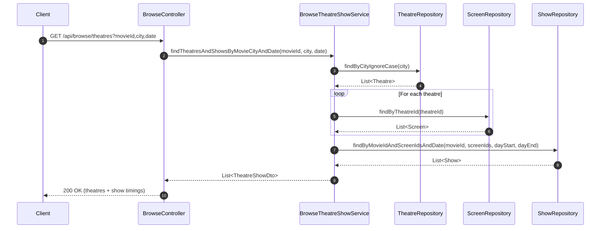
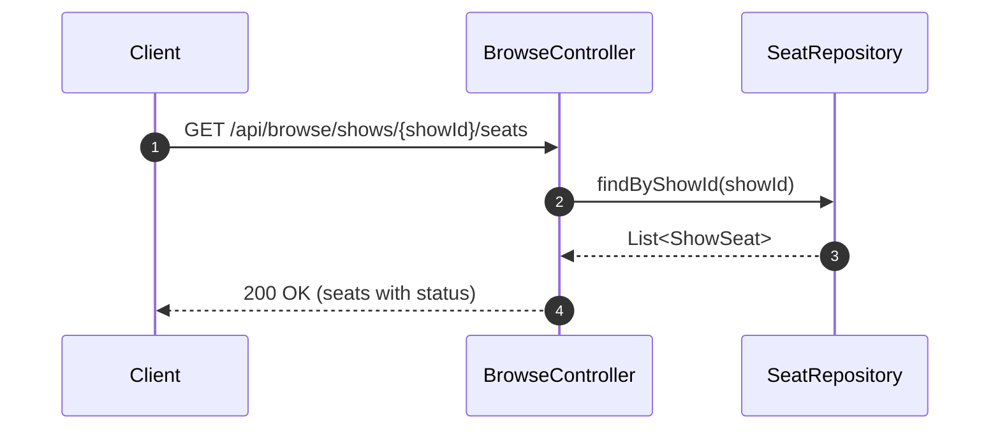
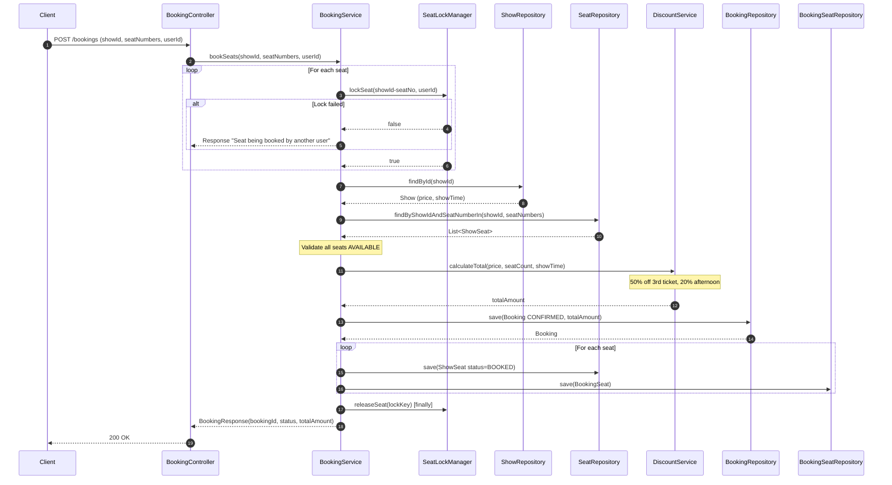
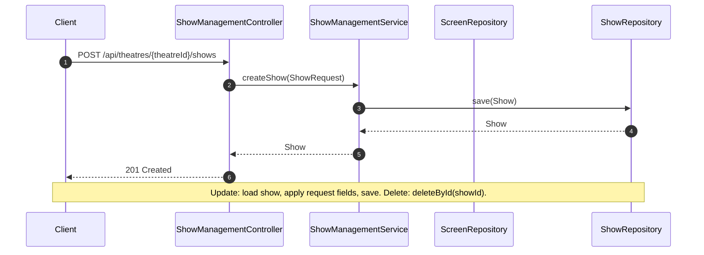
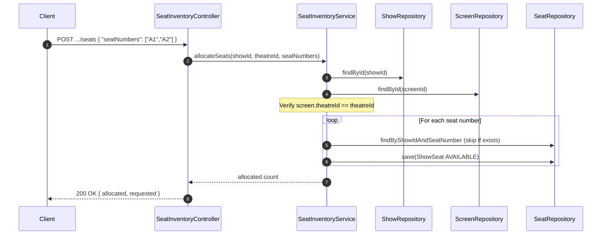
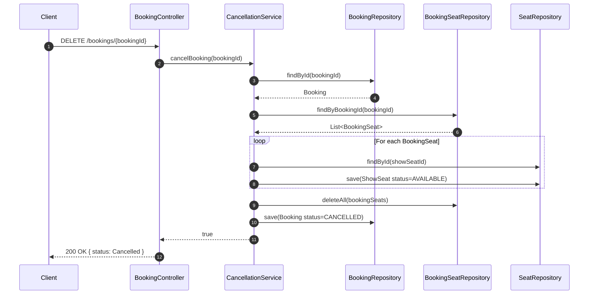
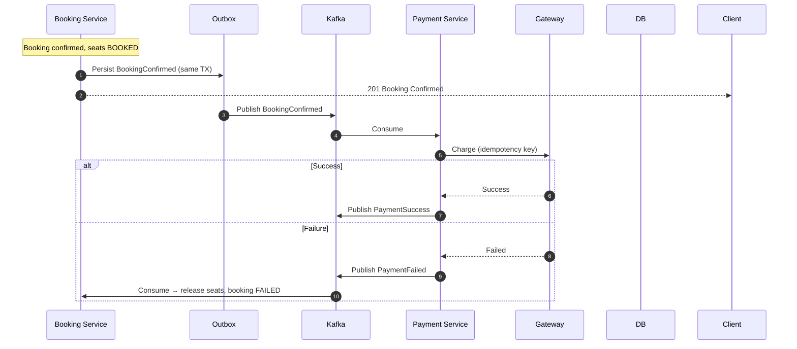

# 🔁 SequenceDiagram.md — Runtime Flows of the Booking Platform

This document captures the **critical execution paths** of the system as **implemented** in the booking-com.movie.booking.service. Diagrams are in **Mermaid** (render in GitHub or any Mermaid viewer).

---

# 1️⃣ Browse Theatres and Shows (by Movie, City, Date)

**API:** `GET /api/browse/theatres?movieId=1&city=Mumbai&date=2025-02-25`

✅ Read-only; no locks. Used to choose theatre and show before booking.

---

# 2️⃣ List Seats for a Show

**API:** `GET /api/browse/shows/{showId}/seats`

✅ Lets user pick preferred seats (e.g. A1, A2, A3) for the booking request.

---

# 3️⃣ Book Seats (Single or Multi-Seat, with Discounts)

**API:** `POST /bookings` — Body: `{ "userId", "showId", "seatNumbers": ["A1","A2","A3"] }`

✅ Single transaction; in-memory lock per seat; discounts applied; one Booking + N BookingSeat rows.

---

# 4️⃣ Theatre Creates / Updates / Deletes Show

**APIs:** `POST /api/theatres/{theatreId}/shows`, `PUT .../shows/{showId}`, `DELETE .../shows/{showId}`

✅ Theatre ownership checked on create/update via screen → theatre.

---

# 5️⃣ Theatre Allocates or Updates Seat Inventory

**APIs:** `POST /api/theatres/{theatreId}/shows/{showId}/seats` (allocate), `PATCH .../seats/{seatNumber}?status=...` (update)

✅ Allocate creates `show_seat` rows. Update flow: load seat, validate not BOOKED, set status, save.

---

# 6️⃣ Cancel Booking and Bulk Cancel

**APIs:** `DELETE /bookings/{bookingId}`, `POST /bookings/bulk-cancel` { "bookingIds": [1,2,3] }

✅ Bulk cancel: same flow per bookingId; return count of cancelled.

---

# 7️⃣ Target: Payment Saga (Future)

When payment is integrated asynchronously:

✅ Saga: confirm booking first; payment async; compensate on failure.

---

# ✔ Summary

| Flow | Implemented | Description |
|------|-------------|-------------|
| Browse theatres/shows | ✅ | By movie, city, date |
| List seats | ✅ | Per show |
| Book seats | ✅ | Multi-seat, discounts, in-memory lock, single TX |
| Show CRUD | ✅ | Theatre create/update/delete shows |
| Seat inventory | ✅ | Allocate and update seat status |
| Cancel / bulk cancel | ✅ | Release seats, mark CANCELLED |
| Payment saga | 🔜 Target | Async event-driven with compensation |

Current implementation uses a single com.movie.booking.service and database; concurrency is handled with in-memory locks and transactions. The target architecture (Redis lock, Kafka, idempotency, payment saga) is described in [DESIGN.md](DESIGN.md).
